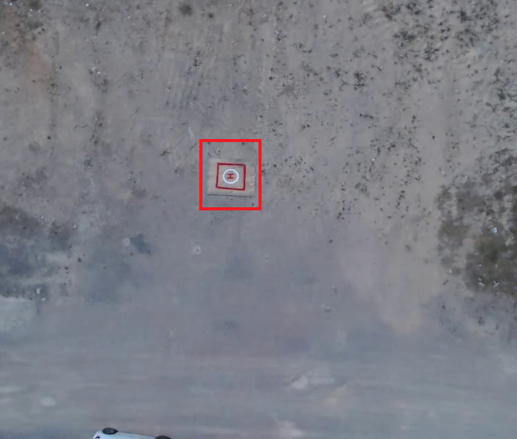
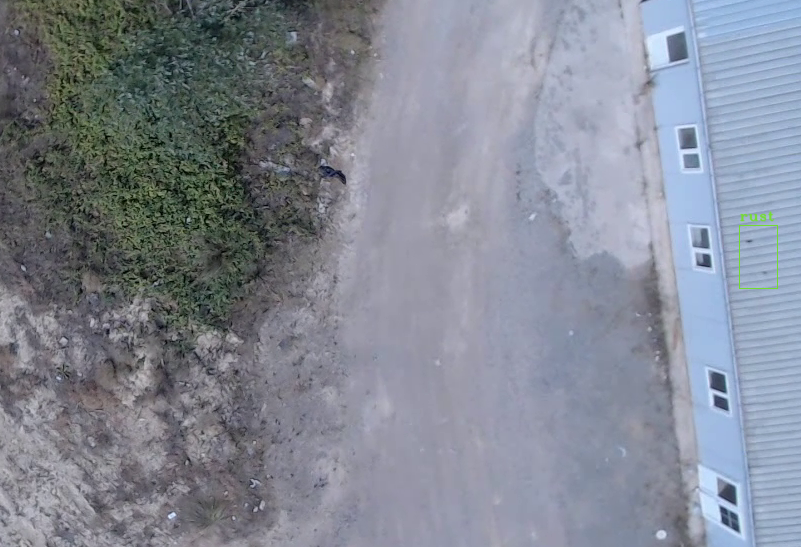
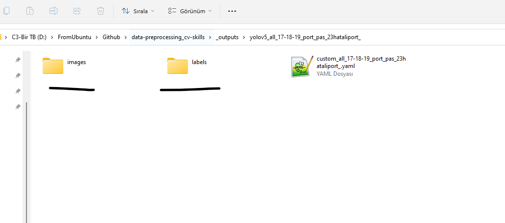
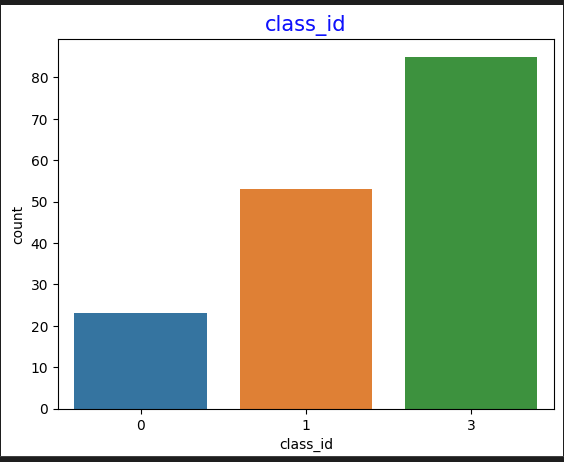

# Data Preprocessing and CV Skills

## What is it?
Bu repo Bilgisayarlı Görü (Computer Vision) yetenekleri geliştirmek için yaratılmıştır.

Hope this might be useful to someone! :-)

## Who am I?
>Hi 👋

## What to do next:
- [x] readme yaratılacak
- [x] requirements yaratılacak(pipreqs) – her kütüphane ihtiyacında güncellenecek
- [x] output ve data şeklinde klasor yapısı olacak
- [x] main başlayacak
- [x] config dosyası olacak ilk veriler oradan alınacak
- [x] video operasyonu var ise bağımsız class olacak
- [x] tool sınıfı olacak ıse yarar hesaplamalar orda duracak
- [x] drawing sınıfı olacak o sayede tüm çizimler yapılacak
- [ ] Her yeni CV yeteneği çıktısını readme ekle

## How does it work?
- [x] splitdataset çalıştırıp dataset ayrılır(train-valid).
- [x] dataanalysis çalıştırılır, oluşan csv dataanalysis_visualization.ipython yorumlanır.
- [] splitte hem yolov3 hemde yolov5 için dosyalar rastgele seçilmeli

## Overview

### Projects

#### Yarı otomatik etiketleme

- **Summary:** Video üzerinden seçili objeyi takip edip etiketleme. Önce ilk sınıftan toplam sınıfa kadar döngü şeklinde etıketleme yapılır. 
- **Keywords:** 
<table style="width:100%">
  <tr>
    <th>
      

           
            <a href="./semi_labeling.py" >(semi_labeling.py)</a>
      

    </th>
  </tr>
</table>

#### Yarı otomatik etiketleme

- **Summary:** Daha önce eğitilmiş bir model video üzerinde tahminleme yaptırılıp, etiketlemeye yardımcı olması sağlanır. 
- **Keywords:** 
<table style="width:100%">
  <tr>
    <th>
      

           
            <a href="./pretrain_model_for_labeling.py" >(pretrain_model_for_labeling.py)</a>
      

    </th>
  </tr>
</table>

#### Split Sataset

- **Summary:** Etiketleme veya pretrained ile hazırlanmış veriyi configkteki oranlara göre ayırır. 
- **Keywords:** 
<table style="width:100%">
  <tr>
    <th>
      

           
            <a href="./splitdataset.py" >(splitdataset.py)</a>
      

    </th>
  </tr>
</table>

#### Data Analysis

- **Summary:** veri ile ilgili csv dosyası yaratılır. Bu dosyada width height bulunduğu region alan gibi özellikler bulunur ve bu dosya dataanalysis_visualization.ipynb dosyasında grafiklerle incelenir.
- **Keywords:** 
<table style="width:100%">
  <tr>
    <th>
      

           
            <a href="./dataanalysis.py" >(dataanalysis.py)</a>
      

    </th>
  </tr>
</table>