# Data Preprocessing and CV Skills

## What is it?
Bu repo Bilgisayarlı Görü (Computer Vision) yetenekleri geliştirmek için yaratılmıştır.

Hope this might be useful to someone! :-)

## Who am I?
>Hi 👋

## What to do next:
- [x] readme yaratılacak
- [x] requirements yaratılacak(pipreqs) – her kütüphane ihtiyacında güncellenecek
- [x] output ve data şeklinde klasor yapısı olacak
- [x] main başlayacak
- [x] config dosyası olacak ilk veriler oradan alınacak
- [x] video operasyonu var ise bağımsız class olacak
- [x] tool sınıfı olacak ıse yarar hesaplamalar orda duracak
- [x] drawing sınıfı olacak o sayede tüm çizimler yapılacak
- [ ] Her yeni CV yeteneği çıktısını readme ekle

## How does it work?
reponun bir adım gerisindeki kutuphaneler:
pretrained için
git clone https://github.com/ultralytics/yolov5.git
requirements.txt yükle: pip install -r requirements.txt

deepsort için
git clone https://github.com/nwojke/deep_sort.git
requirements.txt yükle: pip install -r requirements.txt

Gradio için:
pip install -qr https://raw.githubusercontent.com/ultralytics/yolov5/master/requirements.txt gradio

## Overview

### Projects

#### Yarı otomatik etiketleme

- **Summary:** Video üzerinden seçili objeyi takip edip etiketleme. Önce ilk sınıftan toplam sınıfa kadar döngü şeklinde etıketleme yapılır. 
- **Keywords:** 
<table style="width:100%">
  <tr>
    <th>
      

           
            <a href="./semi_labeling.py" >(semi_labeling.py)</a>
      

    </th>
  </tr>
</table>

#### Yarı otomatik etiketleme

- **Summary:** Daha önce eğitilmiş bir model video üzerinde tahminleme yaptırılıp, etiketlemeye yardımcı olması sağlanır. 
- **Keywords:** 
<table style="width:100%">
  <tr>
    <th>
      

           
            <a href="./pretrain_model_for_labeling.py" >(pretrain_model_for_labeling.py)</a>
      

    </th>
  </tr>
</table>

#### Split Sataset

- **Summary:** Etiketleme veya pretrained ile hazırlanmış veriyi configkteki oranlara göre ayırır. 
- [] splitte hem yolov3 hemde yolov5 için dosyalar rastgele seçilmeli
- **Keywords:** 
<table style="width:100%">
  <tr>
    <th>
      

           
            <a href="./splitdataset.py" >(splitdataset.py)</a>
      

    </th>
  </tr>
</table>

#### Data Analysis

- **Summary:** veri ile ilgili csv dosyası yaratılır. Bu dosyada width height bulunduğu region alan gibi özellikler bulunur ve bu dosya dataanalysis_visualization.ipynb dosyasında grafiklerle incelenir.

- **Keywords:** 
<table style="width:100%">
  <tr>
    <th>
      

           
            <a href="./dataanalysis.py" >(dataanalysis.py)</a>
      

    </th>
  </tr>
</table>

#### DeepSort

- **Summary:** detectiondan gelen bounding box larla sonraki framelerde aynı id almasını sağlyan kod bloğu.
- **Keywords:** 
<table style="width:100%">
  <tr>
    <th>
      

           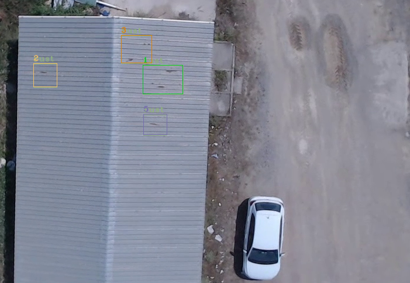
            <a href="./deepsort.py" >(deepsort.py)</a>
      

    </th>
  </tr>
</table>

#### Image Stabilization Via Gaussian Filters In Opencv

- **Summary:** 
- **Keywords:** 
<table style="width:100%">
  <tr>
    <th>
      

           
            <a href="./video_stabilization/main.py" >(video_stabilization.py)</a>
      

    </th>
  </tr>
</table>

#### Detection Model Representation with Gradio-HuggingFace

- **Summary:** 
- **Keywords:** 
<table style="width:100%">
  <tr>
    <th>
      

           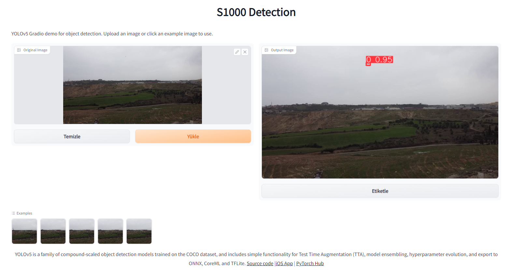
            <a href="./model_representation/detection/app.py" >(app.py)</a>
      

    </th>
  </tr>
</table>

#### Segmentation Model Representation with Gradio-HuggingFace

- **Summary:** 
- **Keywords:** 
<table style="width:100%">
  <tr>
    <th>
      

           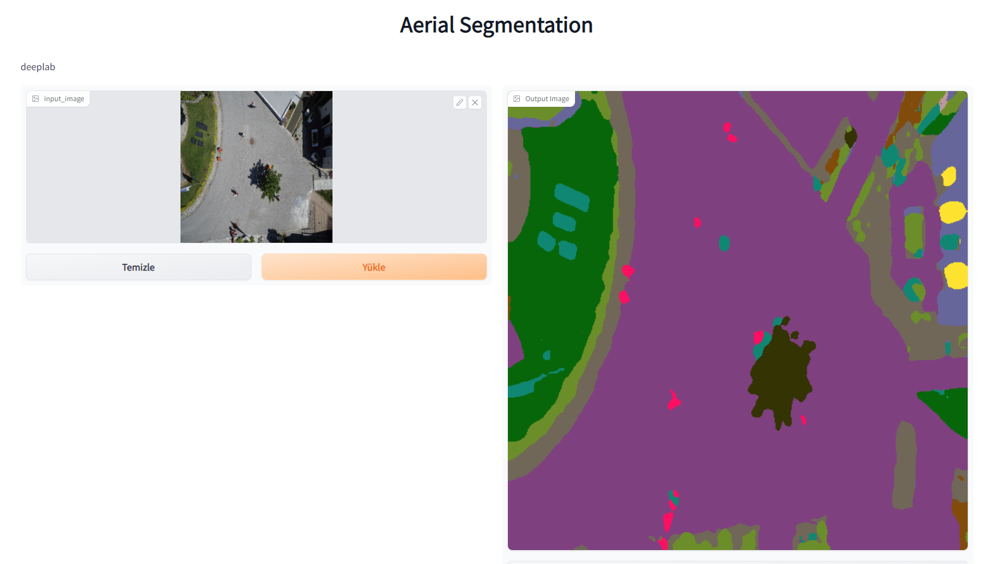
            <a href="./model_representation/segmentation/app.py" >(app.py)</a>
      

    </th>
  </tr>
</table>

#### Kalman Filters Estimation

- **Summary:** 
- **Keywords:** 
<table style="width:100%">
  <tr>
    <th>
      

           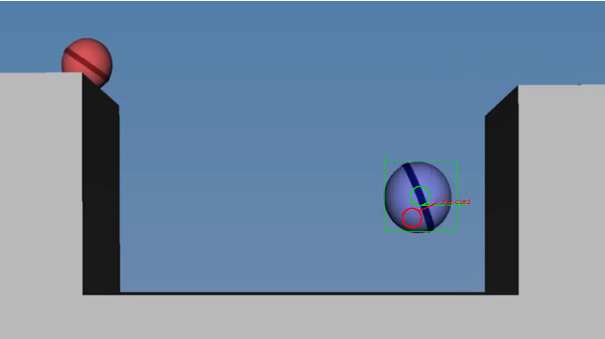
            <a href="./kalman_filters_estimation.py" >(kalman_filters_estimation.py)</a>
      

    </th>
  </tr>
</table>

#### Camera Calibration

- **Summary:** 
- **Keywords:** 
<table style="width:100%">
  <tr>
    <th>
      

           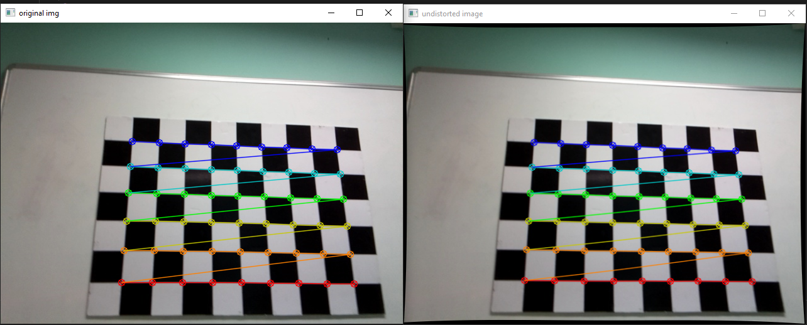
            <a href="./camera_calibration.py" >(camera_calibration.py)</a>
      

    </th>
  </tr>
</table>

#### Simple Background Estimation in Videos

- **Summary:** We can assume most of the time, every pixel sees the same piece of the background because the camera is not moving. Occasionally, a car or other moving object comes in the front and obscure the background.
- **Keywords:** Background Estimation
<table style="width:100%">
  <tr>
    <th>
      

           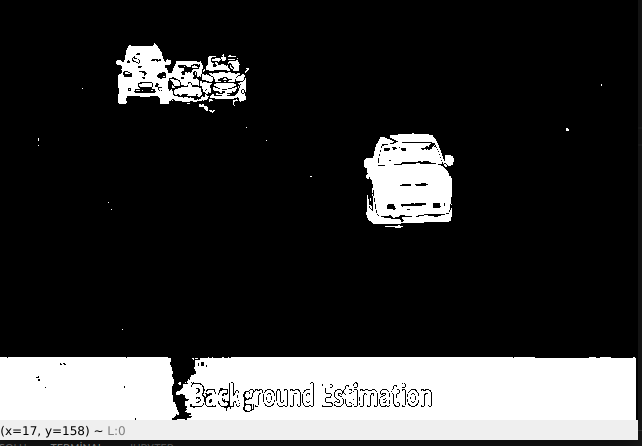
            <a href="./background_estimation.py" >(background_estimation.py)</a>
      

    </th>
  </tr>
</table>

#### Background Subtraction with OpenCV and BGS Libraries

- **Summary:** WSteeping into the idea behind these CV-systems we can observe that in most cases the initial steps contain background subtraction (BS), which helps to obtain relatively rough and rapid identifications of the objects in the video stream for their further subtle handling. In the current post, we are going to cover several noteworthy algorithms in terms of accuracy and processing time BS methods: SuBSENSE and LSBP-based GSoC method.
- **Keywords:** Background Estimation
<table style="width:100%">
  <tr>
    <th>
      

           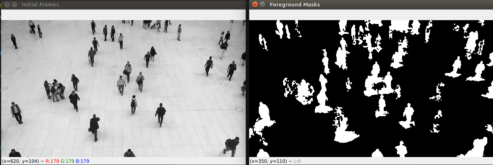
            <a href="./background_subtraction_opencv.py" >(background_subtraction_opencv.py)</a>
      

    </th>
  </tr>
</table>

#### Hough Transform-Line&Circle

- **Summary:** 
- **Keywords:** 
<table style="width:100%">
  <tr>
    <th>
      

           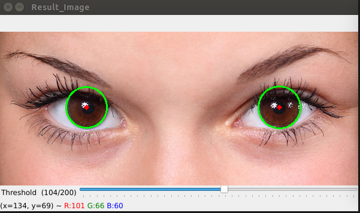
            <a href="./hough_circles.py" >(hough_circles.py)</a>
      

    </th>
  </tr>
  <tr>
    <th>
      

           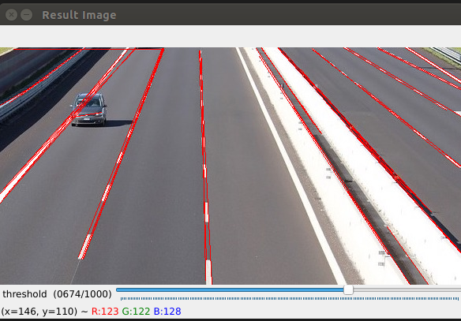
            <a href="./hough_lines.py" >(hough_lines.py)</a>
      

    </th>
   </tr>
</table>

#### Image Filtering Using Convolution in OpenCV

- **Summary:** 
- **Keywords:** 
<table style="width:100%">
  <tr>
    <th>
      

           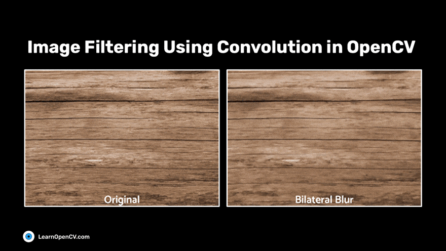
            <a href="./image_filtering.py" >(image_filtering.py)</a>
      

    </th>
  </tr>
</table>

#### Mouse in OpenCV GUI

- **Summary:** 
- **Keywords:** 
<table style="width:100%">
  <tr>
    <th>
      

           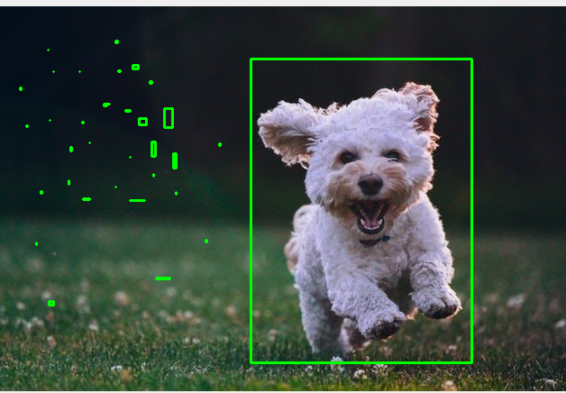
            <a href="./mouse.py" >(mouse.py)</a>
      

    </th>
  </tr>
</table>

#### Trackbar in OpenCV GUI

- **Summary:** 
- **Keywords:** 
<table style="width:100%">
  <tr>
    <th>
      

            <a href="./trackbar.py" >(trackbar.py)</a>
      

    </th>
  </tr>
</table>